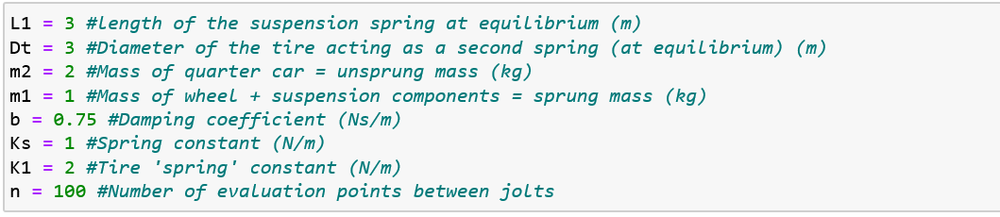
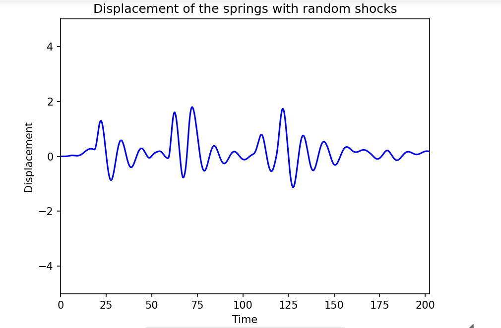
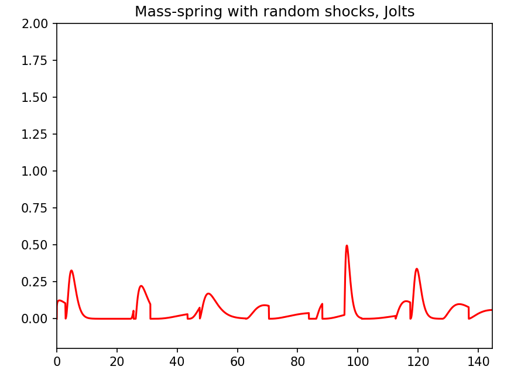

# Quarter Car Suspension System
This repository contains the necessary Python **Code** to animate a quarter car suspension system. It also includes two different graphs related to the system. The animation is far from being perfect but to understand better the physics related to this system along with all the assumptions made, please [_Click Here_](https://www.overleaf.com/project/5e7bdfdf01e2980001f1711d) to take a look at the associated article.

This ESP is a final assessment at Vanier College. It concerns two different courses: Differential Equations by professor [_Ivan T. Ivanov_](http://gauss.vaniercollege.qc.ca/~iti/), and Probability & Statistics by professor [_Sandi Wing May Mak_](http://gauss.vaniercollege.qc.ca/~maks/).

## Installation
Once GitHub is installed on your computer, in your Command Prompt (Cmd) type:

git clone https://github.com/2Talmaci/Quarter-Car-Suspension-System.git

Or, you can clone and download the zip file from the above option. 

## Modifications
The animation and the code can be modified by simply changing the parameters of the system such as the spring lengths, the masses, the spring constants and the dampening coefficient. The initial conditions and the functions (differential equations) defining the system can also be varied for other purposes. 

